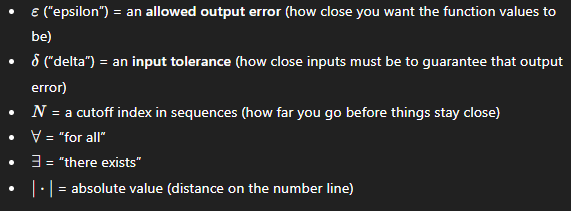

The author says it can describe mathematics in two major ways: equivalence problems and the study of functions.

1) Equivalence problems
mathematics want to know when things are the same, or when they are equivalent. Thus, mathematic branches are distinguished from one another by what "the same" means n this context.

It's interesting how one area of mathematics can be defined as consisting certain Objects coupled with the notion of Equivalence between these objects.

An equivalence problem is determining when two objects are the same using allowable maps.

Another interesting take is on the existence of a branch of mathematics depending on whether the equivalence problem is too easy to solve for some class of objects or too hard to for some class of objects.

Apparently the research areas of mathematics are those where there are rich partials but not complete answers... that means:

Partial answers = invariants and criteria that can often distinguish objects, solve special cases, or classify subsets.

Not complete = there’s no known universal invariant/canonical form/algorithm that classifies all objects under that equivalence.

The notion of invariance is explained with an example of one circle vs two circles. It states that a connected component is basically a separate piece (one circle is one connected component and two separate circles are two pieces = 2 connected components).

A function over this space is going to take any topological space -> output the number of pieces it has.

Because if you only bend and twist a circle (no tearing or gluing allowed anyways) you cannot turn one piece into two pieces without tearing/gluing.

So a topological space that bend and twists its only circle it still outputs 1. This lets us conclude that:

- two spaces giving different numbers they're definitely not equivalent
- if the two spaces give the same number that doesn't guarantee they are equivalent but that this particular test cannot tell them apart

example: a sphere and a circle both contain 1 connected component but are not equivalent because there is the space dimension which is another topological invariant. So the goal of topology is to find enough invariants to be able to always determine when two spaces are different or the same.

2) The study of functions

The author says functions describe the world. Without being too poetic, the world is bound by time and time is bound by change thus functions are actually maps to the future.

The author then says that functions can be reused to different problems and that different areas of maths study different type of functions. 

**Breif Summaries of Topics**

01. Linear Algebra
- linear algebra is about vectors and functions that move vectors in straight-line ways (linear transformations). When you choose a basis (a coordinate system), every vector becomes a list of numbers and every linear transformation becomes a matrix.

A huge idea is to know that a matrix is invertivle exactly when it doesn't "squash" space - meaning you can always uniquely undo it (equivalently: no nonzero vector gets sent to zero, full rank, nonzero determinant, etc.)

Eigenvectors/eigenvalues show up because they are special directions that a transformation doesn't roate - only stretches or flips - whic makes understanding and computing with transformations much easier.

02. Real Analysis
- limits continuity derivatives integrals

03. Differentiating Vector-Valued Functions
The goal of the Inverse Function Theorem is to show that a differentiable function f: Rn -> Rn is locally invertible if and only if the determinant of its derivative (the Jacobian) is non-zero.