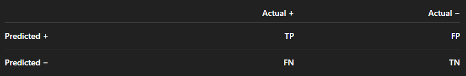
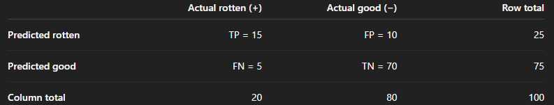

There are three concepts: Precision, Recall & Accuracy

Precision uses row formula: Tp/Tp+Fp
Recall uses column formula: Tp/Tp+Fn
Accuracy uses diagonal formula: Tp+Tn/Tp+Fp+Fn+Tn

I predicted 25 apples as rotten 15 are really rotten and 10 were actually ok
I predicted 75 apples as good and 5 are "false negative:good"=rotten and 70 are actually good

Overall - accuracy is how many of my predictions are actually true (Tp & Tn) over all predictions

p.s. note that in out setup we associate positive (+) with rotten and negative (-) with good